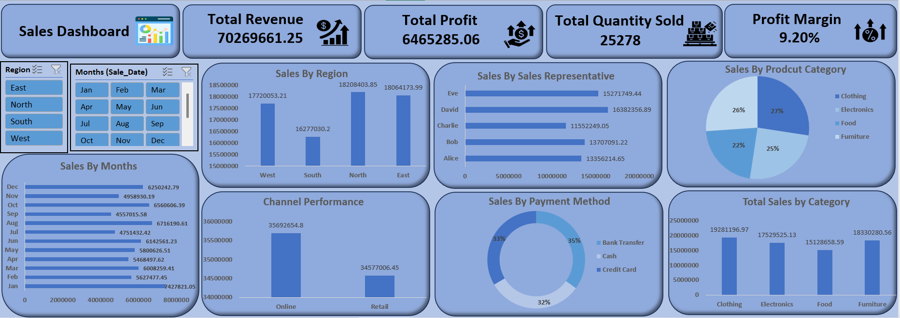

# 📊 Sales Dashboard Project – Microsoft Excel

## 🔍 Project Overview
This project is an **interactive Sales Dashboard created using Microsoft Excel** to analyze sales performance across key business dimensions such as revenue, profit, quantity sold, regions, months, product categories, sales representatives, sales channels, and payment methods.

The dashboard is fully built using **Excel features only** and is designed for quick analysis and business decision-making.

---

## 🎯 Project Objectives
- Track total revenue, profit, and quantity sold
- Analyze sales performance by region and month
- Identify top-performing product categories
- Evaluate sales representative performance
- Compare Online vs Retail sales channels
- Analyze customer payment method distribution
- Create an interactive dashboard using Excel

---

## 🛠 Tools & Techniques Used
- **Microsoft Excel**
- Pivot Tables
- Pivot Charts (Column, Bar, Pie, Doughnut)
- Slicers (Region, Month)
- Conditional Formatting
- Excel formulas:
  - SUM
  - SUMIFS
  - COUNTIFS
  - IF
  - XLOOKUP
- Data Cleaning & Formatting

> No VBA or macros were used in this project.

---

## 📂 Dataset Description
The dataset contains the following fields:
- Sale Date
- Region (East, North, South, West)
- Product Category (Clothing, Electronics, Food, Furniture)
- Sales Representative
- Sales Channel (Online, Retail)
- Payment Method (Credit Card, Cash, Bank Transfer)
- Revenue
- Profit
- Quantity Sold

---

## 📈 Key KPIs (From Dashboard)
- **Total Revenue:** 7,026,961.25  
- **Total Profit:** 6,465,285.06  
- **Total Quantity Sold:** 25,278  
- **Profit Margin:** 9.20%

---

## 📊 Dashboard Components
- KPI cards for Revenue, Profit, Quantity Sold, and Profit Margin
- Sales by Region (Column Chart)
- Sales by Month (Bar Chart)
- Sales by Product Category (Pie Chart)
- Sales by Sales Representative (Bar Chart)
- Channel Performance (Online vs Retail)
- Sales by Payment Method (Doughnut Chart)
- Interactive slicers for Region and Month

---

## 🖼 Dashboard Preview

---

## 🔍 Key Insights
- **North and East regions** contribute the highest sales revenue
- **Online channel** generates higher sales compared to Retail
- **Clothing and Furniture** are the top-performing product categories
- **David and Eve** are the highest contributing sales representatives
- Monthly sales trends indicate seasonal fluctuations
- Payment methods are evenly distributed across Credit Card, Cash, and Bank Transfer

---

## 💡 Business Value
This Excel dashboard helps businesses to:
- Monitor sales performance at a glance
- Identify high-performing regions and products
- Understand sales trends and seasonality
- Analyze customer payment behavior
- Support data-driven decision-making using Excel

---

## 🚀 How to Use
1. Download the Excel file from this repository
2. Open it in **Microsoft Excel**
3. Use **Region** and **Month** slicers to filter data
4. All KPIs and charts update automatically

---

## 📌 Conclusion
This project demonstrates strong skills in **Excel dashboard creation, data analysis, and business reporting**.  
It highlights the ability to transform raw sales data into actionable insights using **Microsoft Excel only**.

---

## 👤 Author
**Harshal Patil**  
Aspiring Data Analyst  
**Skills:** Excel | SQL | Power BI | Data Analysis | Dashboarding  
GitHub: https://github.com/yourusername
